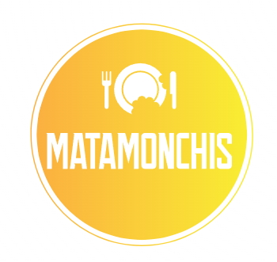

<div align="center">



# SnackFlow POS

Sistema de punto de venta para **La Matamonchis S.A.**, empresa de venta de snacks en eventos masivos.

Proyecto universitario — **ISW-1013 Calidad del Software** · UTN · II Cuatrimestre 2026

[](https://nodejs.org/)
[](https://expressjs.com/)
[](https://neon.tech/)
[](https://www.docker.com/)
[](https://jestjs.io/)
[](http://localhost:3000/api-docs)

</div>

---

## Índice

- [¿Qué es SnackFlow?](#qué-es-snackflow)
- [Funcionalidades](#funcionalidades)
- [Stack tecnológico](#stack-tecnológico)
- [Cómo levantarlo](#cómo-levantarlo)
- [Variables de entorno](#variables-de-entorno)
- [Estructura del proyecto](#estructura-del-proyecto)
- [Roles](#roles)
- [Historias de usuario](#historias-de-usuario)
- [Documentación de la API](#documentación-de-la-api)
- [Equipo](#equipo)

## ¿Qué es SnackFlow?

Un POS completo pensado para vender snacks en eventos masivos: login con 2FA, catálogo de productos, flujo de venta con descuentos y promociones automáticas, reportes con gráficos y exportación a Excel, y factura electrónica por correo (PDF + demo de comprobante) — todo con diseño responsive para celular, tablet y escritorio.

Corre con **failover automático**: intenta conectar a una base de datos en la nube (Neon) y, si no hay internet, sigue funcionando contra Postgres local sin interrumpir la venta. Cuando vuelve la conexión, reconecta solo y sincroniza las ventas que quedaron pendientes.

## Funcionalidades

**Ventas**
- Wizard de nueva venta (catálogo → carrito → resumen/cobro) con cálculo de IVA (13%, incluido en el precio), efectivo/vuelto y validación de denominaciones reales de moneda costarricense (múltiplos de ₡5)
- Descuento manual (hasta 10%, con requisitos mínimos) y promoción automática 2x1 en Gelatinas — mutuamente excluyentes, se recalculan solos al cambiar el carrito
- Factura electrónica opcional por correo: resumen en HTML, PDF con el desglose completo, y un XML de demostración con el formato de un Tiquete Electrónico de Hacienda (Costa Rica) — sin firma digital, solo para fines de demostración
- Ver/imprimir el comprobante de cualquier venta del día directo desde el dashboard

**Administración**
- CRUD de usuarios con 2FA obligatorio (Google Authenticator) y contraseña temporal enviada por correo — el admin nunca ve ni define contraseñas
- CRUD de productos con imagen (comprimida en el navegador antes de subir)
- Reportes por transacción/producto/cajero con gráficos (Chart.js) y exportación a Excel con formato real (tablas, filtros, franjas)

**Seguridad e infraestructura**
- JWT + 2FA TOTP, rate limiting por IP+usuario, Helmet
- Sesión se cierra sola tras 10 minutos de inactividad
- Failover Neon ↔ Postgres local en vivo (no solo al arrancar), con sincronización automática de ventas pendientes al reconectar

## Stack tecnológico

| Capa | Tecnología |
|---|---|
| Frontend | HTML + CSS + JavaScript vanilla (sin framework) |
| Backend | Node.js + Express |
| Base de datos | Neon PostgreSQL (nube) con failover automático a PostgreSQL local |
| ORM | Sequelize |
| Autenticación | JWT + 2FA TOTP (Google Authenticator) |
| Documentos | PDFKit (facturas), ExcelJS (reportes) |
| Pruebas | Jest + Supertest |
| Contenedores | Docker + Docker Compose |
| Documentación de API | Swagger (OpenAPI 3.0) + JSDoc |

## Cómo levantarlo

Necesitás [Docker](https://www.docker.com/) y Docker Compose.

```bash
git clone https://github.com/yustin-prz/snackflow.git
cd snackflow
cp .env.example .env   # completá los valores (ver sección de abajo)
docker compose up
```

| Servicio | URL |
|---|---|
| Frontend | http://localhost:8080 |
| API | http://localhost:3000 |
| Documentación Swagger | http://localhost:3000/api-docs |
| Health check | http://localhost:3000/health |

```bash
docker compose down                        # apagar todo
docker compose build --no-cache backend    # reinstalar paquetes npm del backend
docker compose up -d --force-recreate --renew-anon-volumes backend  # tras agregar una dependencia nueva
```

> El esquema de base de datos se gestiona a mano: `database/init.sql` para una instalación nueva, y las migraciones en `database/migrations/*.sql` en orden si ya tenías el proyecto corriendo.

## Variables de entorno

Copiá `.env.example` a `.env` y completá:

| Variable | Descripción |
|---|---|
| `DATABASE_URL` | Conexión a Postgres local (el contenedor `db` de docker-compose) |
| `DATABASE_BACKUP_URL` | Conexión a Neon (nube) — se intenta primero; si falla, usa la local |
| `JWT_SECRET` | String aleatoria de 32+ caracteres para firmar los tokens |
| `JWT_EXPIRES_IN` | Duración del token (ej. `8h`) |
| `SMTP_USER` / `SMTP_PASS` | Cuenta de Gmail con [contraseña de aplicación](https://support.google.com/accounts/answer/185833) — necesaria para crear usuarios y enviar facturas electrónicas |
| `MAIL_FROM` | Remitente que ven los correos salientes |

## Estructura del proyecto

```
snackflow/
├── docker-compose.yml
├── backend/
│   ├── src/            # index.js, config, models, routes, controllers, middlewares
│   ├── services/        # lógica de negocio (una responsabilidad por servicio)
│   └── tests/
├── frontend/
│   ├── pages/            # login, dashboard, usuarios, productos, nueva venta, reportes
│   └── assets/           # css, js, imágenes
└── database/
    ├── init.sql           # instalación nueva
    └── migrations/        # cambios incrementales sobre una BD existente
```

## Roles

| Rol | Puede |
|---|---|
| **Admin** | Todo: reportes, gestión de usuarios, CRUD completo de productos (incluyendo eliminar) |
| **Cajero** | Crear ventas, crear/editar productos — no puede eliminar productos ni entrar a usuarios o reportes |

## Historias de usuario

| HU | Descripción | Estado |
|---|---|---|
| HU-01 | Ingreso seguro (login + 2FA) | ✅ |
| HU-02 | Nueva venta | ✅ |
| HU-03 | Agregar artículo | ✅ |
| HU-04 | Terminar venta | ✅ |
| HU-05 | Descuento manual | ✅ |
| HU-06 | Promoción 2x1 Gelatinas | ✅ |
| HU-07 | Reportes | ✅ |
| HU-08 | Gestión de usuarios (CRUD) | ✅ |

## Documentación de la API

Todos los endpoints están documentados con Swagger/OpenAPI — con el proyecto corriendo, entrá a **http://localhost:3000/api-docs**.

## Equipo

| Nombre | Rol |
|---|---|
| Yustin Eduardo Pérez Castro | Líder |
| Kendal Barrios Calderón | Desarrollador |
| Eduardo Hernández Contreras | Desarrollador |

---

<div align="center">
<sub>ISW-1013 Calidad del Software · Universidad Técnica Nacional (UTN) · 2026</sub>
</div>
